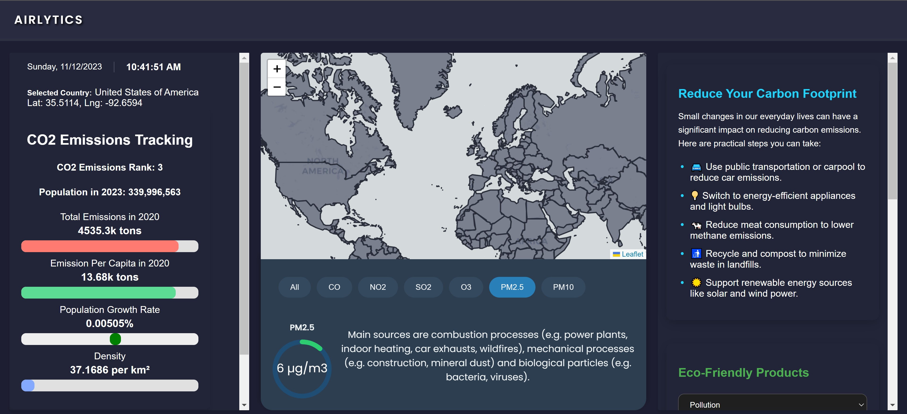

# Airlytics

## Google Drive Video Link
https://drive.google.com/file/d/1KfmBVNx5C0uWCyWfiuHXmt1B_8phpeXM/view?usp=sharing

## Overview
Airlytics is a dynamic visualization tool designed to demonstrate the varying environmental factors across the globe. Leveraging real-time data, this tool provides an insightful view into how different regions experience distinct environmental conditions. This project is ideal for environmental researchers, data analysts, and anyone interested in global environmental trends.



## Applciation Introduction
1. **Interactive Data Visualization:** Airlytics offers an interactive map interface that allows users to explore various environmental factors across different regions of the world.
2. **Real-Time Data Integration:** The tool integrates real-time data to ensure that the information displayed is current and relevant.
3. **Global Locator** The map provides the exact longtitude and latitude that the user clickes on and gives the correponding data for that exact area.
4. **Customizable Data Filters:** Users can customize their data viewing experience by applying filters based on specific environmental metrics.
5. **Responsive Design:** Designed with React, Airlytics is fully responsive and provides an optimal viewing experience across various devices and screen sizes.
6. **Data Caching:** Utilizing AWS S3, the tool efficiently caches data, enhancing performance and user experience.
7. **CI/CD with AWS Amplify:** The use of AWS Amplify ensures continuous integration and continuous deployment, streamlining development workflows.
8. **Secure Data Storage:** AWS S3 is employed to securely store and manage the environmental data, ensuring data integrity and security.

## Features

### CO2 Emissions Tracking

#### Dynamic Data Representation
- Showcases CO2 emissions and environmental data for different countries.
- Dynamically updates based on the selected country.

#### Population and Emissions Data
- Displays population data for 2023.
- Tracks CO2 emissions for 2017 and 2020.
- Offers a comprehensive view of environmental impact.

#### Growth Rate Analysis
- Visualization of the population growth rate.
- Includes a color-coded bar indicating positive or negative growth.
- Note*(The data was scaled against an assumed 6% max population growth)

#### Emissions Per Capita
- Details CO2 emissions per capita.
- Highlights the environmental footprint on an individual level.

#### Interactive Progress Bars
- Features interactive progress bars for total emissions and emissions per capita.
- Compares data from different years to illustrate trends.

#### Density Information
- Presents population density data.
- Provides insights into the population distribution in relation to land area.

### Environmental Air Quality Metrics
- CO
- NO2
- SO2
- O3
- PM 2.5
- PM 10

### Carbon Footprint
- Educational Information about carbon footprint
- Tips and Suggestions for improving environmental factors

### Eco-Friendly Products
- Suggestions of products thta fits sustainability goals

### Local Policies & Initiatives
- Provides information about initiatives and policies of local sustainability efforts(focued on Lehigh Valley)

## Tech Stack
- **React:** For building a dynamic and responsive user interface.
- **AWS Amplify:** Hosting live server and CI/CD Integration.
- **AWS S3:** Efficiently caches data, enhancing performance.

### AWS Amplify
- **CI/CD Integration:** Streamlined development and deployment processes.
- **Server Deployment:** Efficient and scalable cloud server solutions.

### AWS S3
- **Data Storage:** Secure and reliable storage for country-specific environmental data.
- **Caching Mechanism:** Enhanced performance through effective data caching.

## Getting Started

### Prerequisites
- Node.js
- npm or yarn
- AWS Account

### Installation
1. **Clone the repository:**
   ```sh
   git clone https://github.com/Jasonye14/aws-hack2.git
   ```
2. **Navigate to the project directory:**
     ```sh
   cd aws-hack2
   ```
2. **Install dependencies:**
    ```sh
    npm install
    ```
    or 
    ```sh
    yarn install
    ```
2. **Navigate to the project directory:**
    ```sh
    cd aws-hack2
    ```


### Running the Application
1. **Start the React application::**
    ```sh
    npm start
    ```
    or 
    ```sh
    yarn start
    ```
2. **Open your browser and navigate to:**
     ```sh
   http://localhost:3000
   ```
